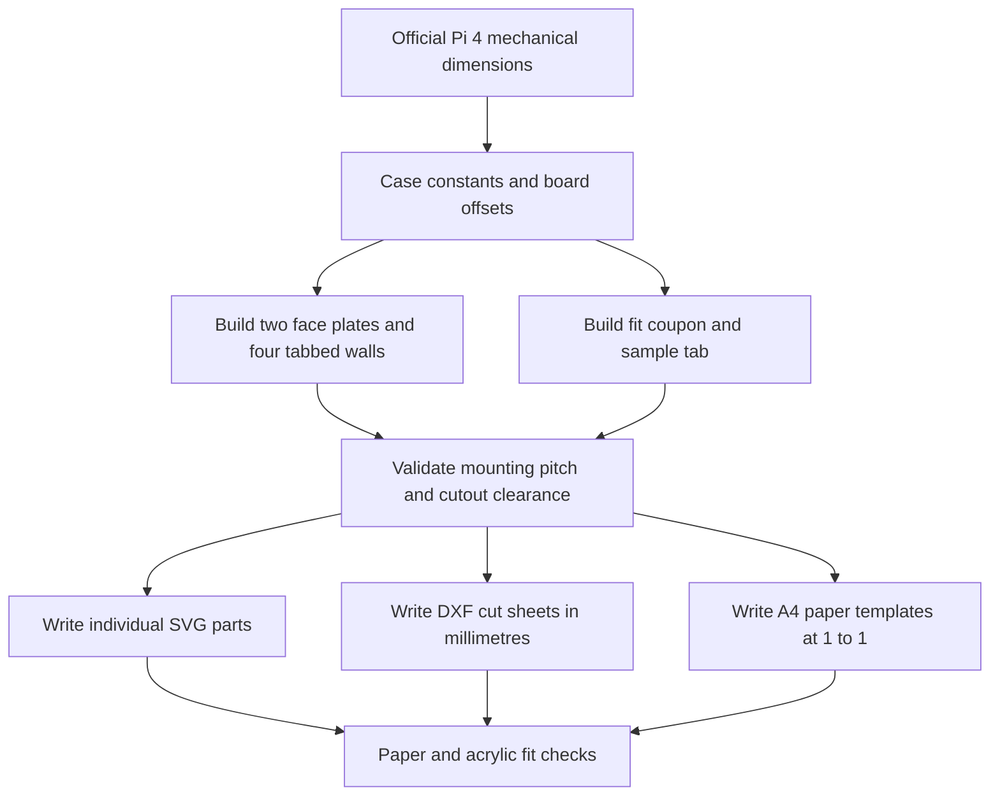

# Raspberry Pi 4 case generation flow

```mermaid
flowchart TD
    A[Official Pi 4 mechanical dimensions] --> B[Case constants and board offsets]
    B --> C[Build two face plates and four tabbed walls]
    B --> D[Build fit coupon and sample tab]
    C --> E[Validate mounting pitch and cutout clearance]
    D --> E
    E --> F[Write individual SVG parts]
    E --> G[Write DXF cut sheets in millimetres]
    E --> H[Write A4 paper templates at 1 to 1]
    F --> I[Paper and acrylic fit checks]
    G --> I
    H --> I
```
