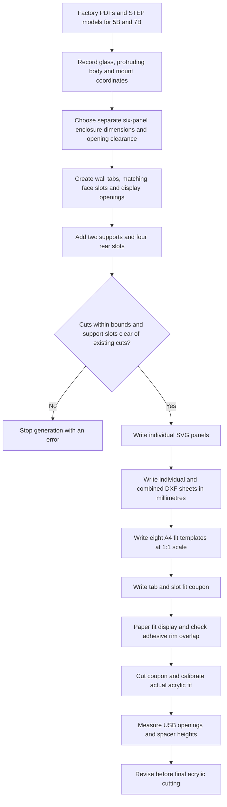

# Acrylic case generation flow

```mermaid
flowchart TD
    A[Factory PDFs and STEP models for 5B and 7B] --> B[Record glass, protruding body and mount coordinates]
    B --> C[Choose separate six-panel enclosure dimensions and opening clearance]
    C --> D[Create wall tabs, matching face slots and display openings]
    D --> P[Add two supports and four rear slots]
    P --> E{Cuts within bounds and support slots clear of existing cuts?}
    E -- No --> F[Stop generation with an error]
    E -- Yes --> G[Write individual SVG panels]
    G --> H[Write individual and combined DXF sheets in millimetres]
    H --> I[Write eight A4 fit templates at 1:1 scale]
    I --> J[Write tab and slot fit coupon]
    J --> K[Paper fit display and check adhesive rim overlap]
    K --> L[Cut coupon and calibrate actual acrylic fit]
    L --> M[Measure USB openings and spacer heights]
    M --> N[Revise before final acrylic cutting]
```
